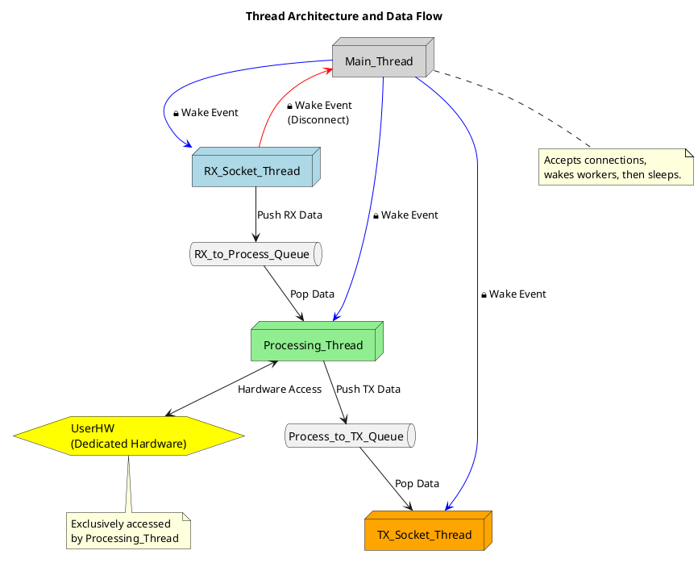
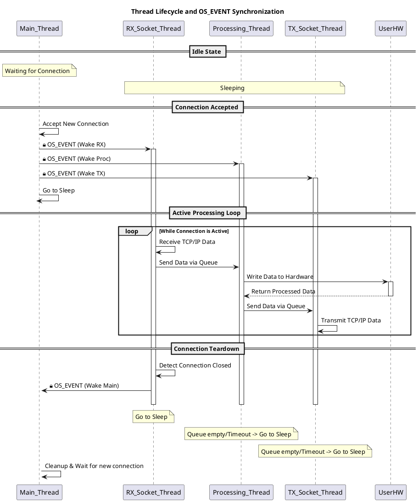

# Diagrama de componentes

```plantuml
@startuml
skinparam componentStyle rectangle
skinparam nodesep 50
skinparam ranksep 50

title Thread Architecture and Data Flow

node "Main_Thread" as Main #LightGray
node "RX_Socket_Thread" as RX #LightBlue
node "Processing_Thread" as Proc #LightGreen
node "TX_Socket_Thread" as TX #Orange

queue "RX_to_Process_Queue" as RX_Q
queue "Process_to_TX_Queue" as TX_Q

hexagon "UserHW\n(Dedicated Hardware)" as HW #Yellow

' Control Flow (Events)
Main -[#blue]-> RX : " 🔒 Wake Event"
Main -[#blue]-> Proc : " 🔒 Wake Event"
Main -[#blue]-> TX : " 🔒 Wake Event"

RX -[#red]-> Main : " 🔒 Wake Event\n(Disconnect)"

' Data Flow
RX --> RX_Q : "Push RX Data"
RX_Q --> Proc : "Pop Data"

Proc <--> HW : "Hardware Access"

Proc --> TX_Q : "Push TX Data"
TX_Q --> TX : "Pop Data"

note bottom of Main
  Accepts connections,
  wakes workers, then sleeps.
end note

note bottom of HW
  Exclusively accessed
  by Processing_Thread
end note
@enduml
```

# Diagrama de fluxo

```plantuml
@startuml
title Thread Lifecycle and OS_EVENT Synchronization

participant "Main_Thread" as Main
participant "RX_Socket_Thread" as RX
participant "Processing_Thread" as Proc
participant "TX_Socket_Thread" as TX
participant "UserHW" as HW

== Idle State ==
note over Main: Waiting for Connection
note over RX, TX: Sleeping

== Connection Accepted ==
Main -> Main: Accept New Connection
Main -> RX: 🔒 OS_EVENT (Wake RX)
activate RX
Main -> Proc: 🔒 OS_EVENT (Wake Proc)
activate Proc
Main -> TX: 🔒 OS_EVENT (Wake TX)
activate TX
Main -> Main: Go to Sleep
deactivate Main

== Active Processing Loop ==
loop While Connection is Active
    RX -> RX: Receive TCP/IP Data
    RX -> Proc: Send Data via Queue
    
    Proc -> HW: Write Data to Hardware
    activate HW
    HW --> Proc: Return Processed Data
    deactivate HW
    
    Proc -> TX: Send Data via Queue
    TX -> TX: Transmit TCP/IP Data
end

== Connection Teardown ==
RX -> RX: Detect Connection Closed
RX -> Main: 🔒 OS_EVENT (Wake Main)
activate Main

note over RX: Go to Sleep
deactivate RX

note over Proc: Queue empty/Timeout -> Go to Sleep
deactivate Proc

note over TX: Queue empty/Timeout -> Go to Sleep
deactivate TX

Main -> Main: Cleanup & Wait for new connection
@enduml
```

